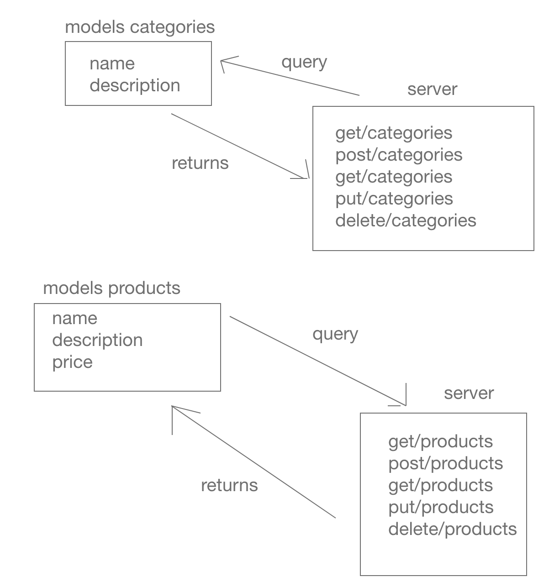

# LAB - 08

## Express Routing

### Author: Adrian Huebner

### Links and Resources
* [submission PR](http://xyz.com)
* [travis](http://xyz.com)
* [front-end](http://xyz.com)

### Modules
#### `categories-model.js`
#### `products-model.js`

### Setup
#### `.env` requirements
* `PORT` - Port Number
* `MONGODB_URI` - URL to the running mongo instance/db

#### Running the app
* `node index.js`
* `mongod --dbpath data/db`

#### UML

